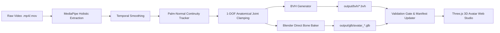

# End-to-End ISL Motion Capture & 3D Avatar Generation Pipeline

An automated, kinematically constrained AI pipeline that converts monocular Indian Sign Language (ISL) video footage into anatomical BioVision Hierarchy (`.bvh`) skeletal motion files and web-optimized 3D avatar animations (`.glb`) ready for real-time 60 FPS playback in WebGL / Three.js.

---

## 🌟 Key Highlights & Engineering Features

1. **Holistic Landmark Extraction**:
   - MediaPipe Holistic (33 Pose + 42 Hand Keypoints + 468 Face Mesh).
   - Missing landmark interpolation & outlier rejection for smooth tracking.

2. **Permanent Kinematic Constraint Layer**:
   - **Palm-Normal Temporal Continuity Tracker**: Reconstructs an orthonormal local coordinate frame ($\hat{u}_{\text{lat}} \times \hat{v}_{\text{long}}$) for wrists and validates temporal dot-product continuity ($\hat{n}_t \cdot \hat{n}_{t-1} \ge -0.2$), automatically preventing and correcting 180° "ghost/reversed hand" artifacts.
   - **1-DOF Anatomical Finger Hinges**: Clamps finger MCP ($-10^\circ$ to $90^\circ$), PIP ($0^\circ$ to $110^\circ$), and DIP ($0^\circ$ to $90^\circ$) joints. Strictly prevents backward hyperextension, bone twist, or interpenetration.
   - **Upright Posture & Gaze Locking**: Stabilizes lower spine/hips vertically in an upright standing pose with level forward eye gaze (no camera-tilt slouch).
   - **Mirrored Bilateral Parity**: Anatomically accurate coordinate frames for both Left and Right hands.

3. **High-Fidelity Blender Direct Bone Baker**:
   - Converts kinematic landmark streams directly into Mixamo standard 65-bone armatures.
   - Automates Non-Linear Animation (NLA) Action strip baking.
   - Downscales textures and optimizes meshes from ~65 MB to **~4.1 MB web-ready GLBs**.

4. **Automated Quality Validation Gate**:
   - Validates clamping percentages, flip detections, and joint safety per video.
   - Generates structured audit reports in `output/processing_report.csv`.

5. **Interactive Three.js 3D Avatar Web Studio**:
   - Real-time 60 FPS browser preview with OrbitControls, directional lighting, playback scrubber, playback speed controls, and dynamic dictionary switcher (`output/signs_manifest.json`).

---

## 📁 Repository Structure

```
├── input_videos/            # Drop your raw .mp4 or .mov ISL videos here
├── pipeline/
│   ├── config.py            # Anatomical joint limits & QA thresholds
│   ├── extractor.py         # MediaPipe Holistic keypoint extraction
│   ├── smoothing.py         # Temporal smoothing & outlier rejection
│   ├── bvh_generator.py     # Kinematic constraint engine & BVH exporter
│   ├── direct_finger_baker.py# Blender background bone solver & NLA baker
│   └── validator.py         # Kinematic and boundary quality assurance gate
├── output/
│   ├── landmarks_json/      # Extracted per-frame 3D keypoints
│   ├── bvh/                 # Generated BioVision motion files
│   ├── glb/                 # Web-optimized 3D avatar animations
│   ├── signs_manifest.json  # Catalog manifest loaded by the Web Studio
│   └── processing_report.csv# Automated QA and kinematic validation report
├── index.html               # Interactive 3D Avatar Web Studio (Three.js)
├── run_pipeline.py          # Universal single-sign and batch CLI runner
├── requirements.txt         # Python dependencies
└── generate_sample_data.py  # Synthetic sign video generator for testing
```

---

## ⚡ Quick Start: Zero to 3D Viewer in 3 Steps

### 1. Prerequisites & Installation

- **Python 3.10+**
- **Blender 4.x or 5.x** (optional, required if baking `.glb` avatar meshes)
- **A Mixamo Character FBX** (e.g. `Ch22_nonPBR.fbx` or any Mixamo standard mesh)

Install dependencies:
```bash
pip install -r requirements.txt
```

---

### 2. Launch the 3D Avatar Studio Web Server

To view existing animations in the interactive 3D viewer:
```bash
python -m http.server 8080
```
Open your browser at **[http://localhost:8080/](http://localhost:8080/)**.

---

### 3. Generate Animations & Add Your Own Signs

#### Option A: Process a Single Video
Drop a video into `input_videos/` (or specify any file path) and run:
```bash
# Generate BVH and validate motion
python run_pipeline.py --file path/to/my_sign.mp4

# Full End-to-End: Extract -> Kinematic BVH -> Bake 3D GLB Avatar -> Update Web Manifest
python run_pipeline.py --file path/to/my_sign.mp4 --bake_glb --blender_exe "C:\Program Files\Blender Foundation\Blender 5.2\blender.exe" --char_fbx "C:\Users\paras\Downloads\Ch22_nonPBR.fbx"
```

#### Option B: Batch Process an Entire Directory of Videos
```bash
python run_pipeline.py --input_dir ./input_videos --output_dir ./output --bake_glb --blender_exe "C:\Program Files\Blender Foundation\Blender 5.2\blender.exe" --char_fbx "C:\Users\paras\Downloads\Ch22_nonPBR.fbx"
```

#### Option C: Re-bake All Existing Landmark Streams
If landmarks are already extracted in `output/landmarks_json/`, re-bake all signs through the latest kinematic solver in seconds:
```bash
python batch_rebake.py
```

---

## 🔬 How the Kinematic Pipeline Works



1. **Extraction**: MediaPipe captures raw wrist, knuckle, and body landmarks.
2. **Ghost-Hand Correction**: The tracker monitors the palm normal vector $\hat{n} = \hat{u}_{\text{lat}} \times \hat{v}_{\text{long}}$ across frames. If the normal vector inverts ($< -0.2$ dot product), it rejects the flip to preserve anatomical palm facing.
3. **1-DOF Hinge Clamping**: All finger knuckle rotations are mapped to 1-DOF local hinge axes with physiological limits, preventing any unnatural reverse bending.
4. **Armature Retargeting & GLB Export**: The background Blender process applies the motion directly to the character skeleton, pushes the keyframes into an NLA track, downscales textures, and exports a standalone ~4 MB GLB.
5. **Auto Manifest Update**: `output/signs_manifest.json` is updated so the web viewer immediately lists the new sign in the UI dropdown.

---

## 📊 Quality Assurance & Validation Report

After every run, `output/processing_report.csv` logs detailed metrics for every processed word:
- `status`: **`CLEAN`**, **`NEEDS_REVIEW`**, or **`FAILED`**
- `ghost_flips_corrected`: Number of raw MediaPipe 180° flips detected and corrected.
- `clamped_frames_pct`: Percentage of frames where anatomical joint limits were active.
- `joints_clamped`: Specific joints clamped (e.g. `RightHandIndex2_PIP`, `RightForeArm`).
- `glb_size_mb`: File size of the generated GLB avatar.

---

## 🤝 Contributing & Adding Custom Datasets

1. Place your video files in `input_videos/<word_name>.mp4`.
2. Run `python run_pipeline.py --input_dir ./input_videos --bake_glb`.
3. Refresh `http://localhost:8080/` to test your new animations on the avatar in real time.

